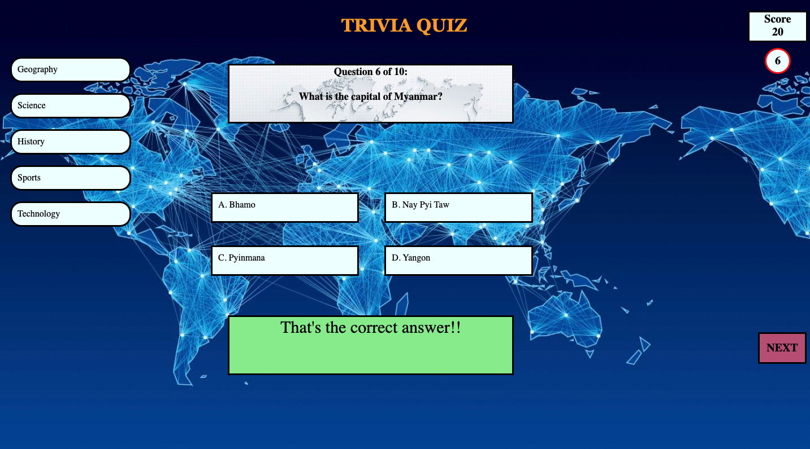
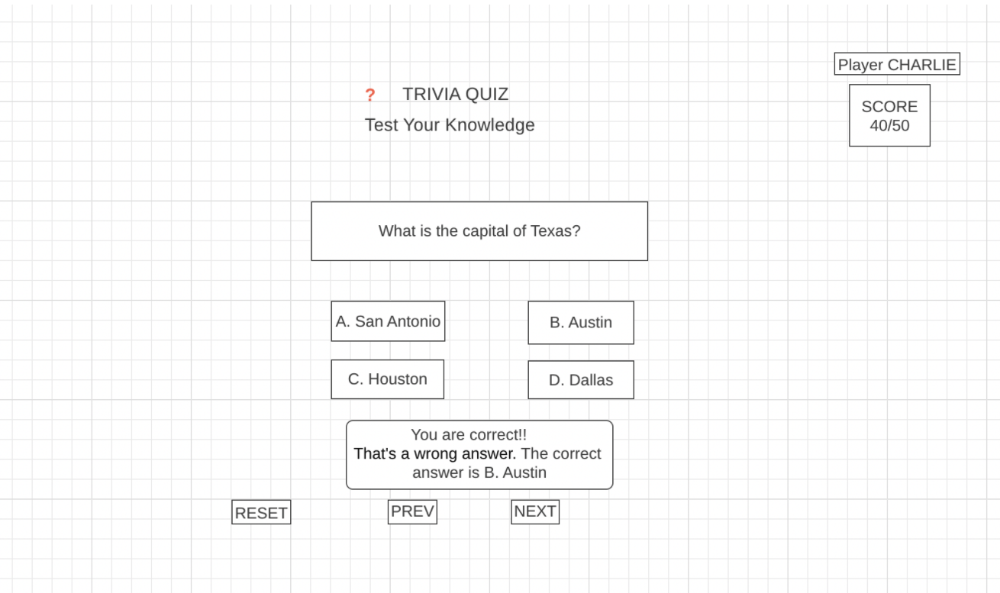
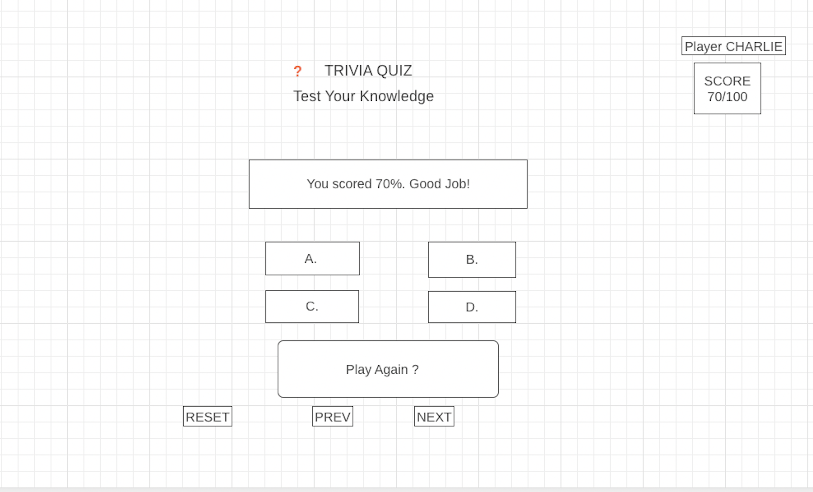

#GA-SEI-Project-Trivia

##Trivia (Self-scoring)

#####SEI 32221 Project Trivia

###Welcome

Welcome to the game of Trivia. It's a quiz to test your knowledge on various topics and categories. This is a one-player game and self scoring. A series of questions on a selected topic will be presented with each having 4 possible answers as options. Each question will get 10 secs to answer. The player will select the option and the app will display if the answer is correct or not. Each correct answer from the player will get 10 points. A challenge in each topic will consist of total 10 questions. The final result after the challenge will display how many correct answers attempted and the total score. 

   

### Technologies used

* JavaScript
* Javascript for DOM manipulation
* CSS (flash, hover, popout, grid)
* HTML

### Installation instructions

* Use chrome browser for accessing the app.
* The app doesnot have responsive design as of yet. Please use your mac **full screen** (and not the monitors) for the web page.
* The app is available on github and can be accessed from the following link:
https://ravalmamit.github.io/Project-Trivia/

### User stories

* As a player, I would like to know the answer option selected for a question is correct answer or not.
* As a player, I would like to know what is the correct answer if incorrect option selected.
* As a player, I would like see my current score during the challenge.
* As a player, I would like to get the end result and final score for each challenge.
* As a player, I would like to retake the challenge after completion of the current challenge.
* As a player, I would like to reset(restart) the challenge.

### Wireframes

### Unsolved problems
* Responsive design - I didn't start the project with the responsive design in mind. The learning experience is to do the responsive design in the start of the project when you are designing the page. 

